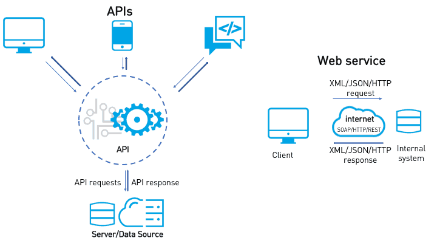
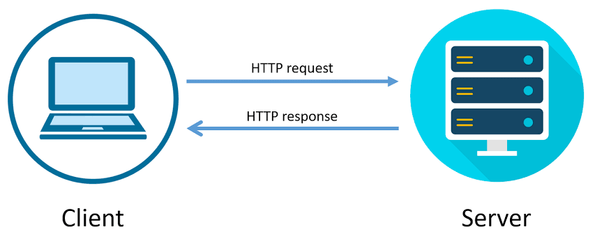

- [Servicios Web](#servicios-web)
  - [Servicios orientados a la conexión vs No orientados a la conexión](#servicios-orientados-a-la-conexión-vs-no-orientados-a-la-conexión)
- [Servicios Web](#servicios-web-1)
  - [Componentes de un Servicio Web](#componentes-de-un-servicio-web)
    - [Request](#request)
    - [Response](#response)
    - [Ejemplos de Servicios Web](#ejemplos-de-servicios-web)
    - [Arquitecturas de Servicios Web](#arquitecturas-de-servicios-web)
  - [Práctica de clase](#práctica-de-clase)

# Servicios Web
Un servicio es una funcionalidad que se ofrece a través de una interfaz (API) y que puede ser utilizada por otros componentes de software, ya sea para acceder a datos, manejar recursos, etc. 

Los servicios pueden ser orientados a la conexión o sin conexión y fijan sus características. Los servicios orientados a la conexión requieren que el cliente y el servidor establezcan una conexión antes de que pueda comenzar la comunicación, como en el caso de una llamada telefónica o FTP, y esta comunicación sigue establecida hasta que se cierre. Los servicios sin conexión, por otro lado, no requieren una conexión establecida y permiten que los mensajes se envíen y reciban independientemente, como en el caso del correo electrónico o la página web, es decir el cliente pide una página web, el servidor se la ofrece y se desconecta. Así se hace por cada enlace que pulsemos.

Los servicios orientados a la conexión y los servicios no orientados a la conexión tienen diferentes ventajas y desventajas. 

## Servicios orientados a la conexión vs No orientados a la conexión

Servicios orientados a la conexión:

*Pros:*

1. **Fiabilidad:** En los servicios orientados a la conexión, los datos se entregan en el orden correcto y sin errores, ya que cada paquete enviado necesita ser reconocido por el receptor.

2. **Control de Flujo:** Los servicios orientados a la conexión permiten un control de flujo, lo que evita que el remitente sobrecargue al receptor con datos.

3. **Control de Congestión:** Estos servicios también permiten un control de congestión, lo que puede prevenir problemas si la red está sobrecargada.

*Contras:*

1. **Tiempo de Configuración:** Los servicios orientados a la conexión requieren un tiempo de configuración inicial para establecer la conexión antes de que los datos puedan ser enviados.

2. **Overhead:** Estos servicios pueden tener un overhead adicional debido a la necesidad de enviar y recibir confirmaciones para cada paquete.

3. **Menos Eficiente para Datos Pequeños:** Para datos pequeños o mensajes individuales, el tiempo y los recursos necesarios para establecer y cerrar una conexión pueden ser más costosos que los beneficios que ofrece.

Servicios No Orientados a la Conexión:

*Pros:*

1. **Rapidez:** Los servicios no orientados a la conexión pueden enviar datos rápidamente, ya que no requieren la configuración inicial de una conexión.

2. **Eficiencia para Datos Pequeños:** Estos servicios pueden ser más eficientes para enviar datos pequeños o mensajes individuales, ya que no hay tiempo de configuración ni overhead de confirmaciones.

3. **Resiliencia:** Los servicios no orientados a la conexión pueden ser más resistentes a los problemas de la red, ya que no dependen de una conexión constante.

*Contras:*

1. **Menos Fiabilidad:** Los servicios no orientados a la conexión pueden no garantizar que los datos se entreguen en orden o sin errores.

2. **Sin Control de Flujo o Congestión:** Estos servicios generalmente no proporcionan control de flujo o congestión, lo que podría llevar a problemas si el receptor no puede manejar la cantidad de datos enviados o si la red está sobrecargada.

3. **Requiere Mayor Gestión de Errores:** Como no hay garantías de entrega, puede ser necesario implementar mecanismos adicionales para manejar errores y asegurar la recepción de los datos.

# Servicios Web

Los servicios web son sistemas de software diseñados para admitir la interacción interoperable entre máquinas a través de una red usando protocolos HTTP entre otros ya existentes. 

Proporcionan una forma estandarizada de integrar aplicaciones basadas en web utilizando XML, JSON, SOAP, WSDL y UDDI abiertos sobre protocolos de Internet. Las ventajas de los servicios web incluyen su capacidad para compartir datos y procesos entre diferentes aplicaciones y sistemas operativos, y la posibilidad de reducir los costos al permitir la comunicación entre diferentes aplicaciones de software. Sin embargo, también pueden tener desventajas, como la complejidad de su implementación y la posibilidad de problemas de seguridad.

El protocolo HTTP (Hypertext Transfer Protocol) es la base de cualquier intercambio de datos en la Web y es un protocolo sin estado y basado en texto. Los servicios web que utilizan HTTP ofrecen varias ventajas:

1. **Interoperabilidad:** HTTP es un protocolo universalmente aceptado y ampliamente utilizado. Esto significa que los servicios web que utilizan HTTP pueden interactuar con una amplia variedad de clientes y servidores, independientemente del lenguaje de programación, la plataforma o el sistema operativo que utilicen.

2. **Simplicidad:** HTTP es un protocolo basado en texto y sin estado, lo que significa que es relativamente fácil de usar y entender. Los mensajes HTTP son legibles por humanos, lo que facilita la depuración y el diagnóstico de problemas.

3. **Compatibilidad con REST:** HTTP es el protocolo subyacente utilizado por los servicios web RESTful. Esto significa que los servicios web que utilizan HTTP pueden aprovechar las ventajas de la arquitectura REST, que es simple, escalable y eficiente.

4. **Seguridad:** A través de HTTPS (HTTP Secure), HTTP ofrece un nivel de seguridad al cifrar los datos que se transmiten entre el cliente y el servidor. Esto es especialmente importante cuando se manejan datos sensibles, como información personal o de pago.

5. **Caching:** HTTP ofrece capacidades de almacenamiento en caché, lo que puede mejorar la eficiencia y el rendimiento al permitir que los clientes almacenen y reutilicen respuestas previamente obtenidas.

6. **Soporte de Sesión y Cookies:** Aunque HTTP es un protocolo sin estado, se pueden utilizar cookies y sesiones para mantener el estado entre diferentes solicitudes HTTP. Esto es útil para cosas como el seguimiento de la actividad del usuario o la autenticación del usuario.

7. **Escalabilidad:** HTTP, debido a su naturaleza sin estado, es inherentemente escalable, lo que permite manejar un gran número de solicitudes simultáneas.

Ten en cuenta que:
- Es una arquitectura **cliente-servidor**, el cliente realiza una solicitud y el servidor proporciona una respuesta. En el contexto de HTTP, un cliente (generalmente un navegador web) envía una solicitud HTTP a un servidor. El servidor entonces procesa la solicitud y devuelve una respuesta HTTP al cliente. La solicitud HTTP incluye un método que indica el tipo de solicitud (como GET, POST, PUT, DELETE, etc.), la URL del recurso solicitado, y opcionalmente, datos adicionales. La respuesta HTTP incluye un código de estado que indica el resultado de la solicitud (como 200 para éxito, 404 para no encontrado, etc.), y también los datos solicitados, si están disponibles.
- Es in **Estado**: HTTP es un protocolo sin estado, lo que significa que cada solicitud se procesa de forma independiente y el servidor no mantiene ninguna información sobre las solicitudes anteriores. Esto simplifica la implementación del servidor y permite la escalabilidad, ya que el servidor no necesita mantener un estado para cada cliente. Sin embargo, para las aplicaciones que requieren mantener el estado del usuario (como las aplicaciones web con inicio de sesión de usuario), se deben utilizar mecanismos adicionales, como las cookies, para mantener el estado a través de múltiples solicitudes HTTP.

## Componentes de un Servicio Web
La comunicación entre cliente y servidor en un servicio web se hace a base de peticiones y respuestas. El cliente envía una petición al servidor y el servidor responde con una respuesta. Estas peticiones y respuestas se envían a través de la red utilizando el protocolo HTTP.

### Request
Un "request" o "solicitud" en el contexto de los servicios web es un mensaje que un cliente (como un navegador web o una aplicación) envía a un servidor para solicitar una acción específica. Esta acción puede ser obtener un recurso (como una página web o una imagen), enviar datos al servidor, actualizar un recurso existente, o eliminar un recurso.

Una solicitud HTTP consta de varias partes:

1. **Método:** El método de la solicitud indica la acción que se debe realizar. Los métodos HTTP más comunes son GET (para obtener un recurso), POST (para enviar datos al servidor), PUT (para actualizar un recurso existente), DELETE (para eliminar un recurso) y HEAD (para obtener solo los encabezados de un recurso).

2. **URL:** La URL (Uniform Resource Locator) especifica el recurso que se debe obtener o la ubicación donde se deben enviar los datos.

3. **Encabezados:** Los encabezados de la solicitud proporcionan información adicional sobre la solicitud, como el tipo de contenido de los datos enviados, el tipo de contenido que el cliente puede aceptar, la codificación de caracteres, las cookies, etc.

4. **Cuerpo:** El cuerpo de la solicitud contiene los datos que se envían al servidor. No todas las solicitudes tienen un cuerpo. Por ejemplo, las solicitudes GET y DELETE generalmente no tienen un cuerpo, mientras que las solicitudes POST y PUT sí lo tienen.

El servidor recibe la solicitud, la procesa y luego envía una respuesta al cliente. La respuesta también es un mensaje que consta de un código de estado (que indica el resultado de la solicitud), encabezados (que proporcionan información adicional sobre la respuesta) y un cuerpo (que contiene los datos solicitados, si están disponibles).

### Response

Un "response" o "respuesta" en el contexto de los servicios web es un mensaje que un servidor envía a un cliente en respuesta a una solicitud. Una respuesta HTTP consta de varias partes:

1. **Código de estado:** El código de estado indica el resultado de la solicitud. Los códigos de estado HTTP son números de tres dígitos. Por ejemplo, "200" indica éxito, "404" indica que el recurso solicitado no se encontró, "500" indica un error del servidor, etc.

2. **Encabezados:** Los encabezados de la respuesta proporcionan información adicional sobre la respuesta o sobre el recurso solicitado. Por ejemplo, los encabezados pueden indicar el tipo de contenido del cuerpo de la respuesta, establecer cookies, controlar el almacenamiento en caché, etc.

3. **Cuerpo:** El cuerpo de la respuesta contiene los datos solicitados, si están disponibles y si la solicitud fue exitosa. No todas las respuestas tienen un cuerpo. Por ejemplo, las respuestas a las solicitudes HEAD y a algunas solicitudes GET no tienen cuerpo.

La respuesta es enviada al cliente a través de la red y el cliente la procesa. Por ejemplo, si el cliente es un navegador web y la respuesta es una página web, el navegador mostrará la página web al usuario. Si la respuesta es una imagen o un archivo de video, el navegador mostrará la imagen o reproducirá el video. Si la respuesta indica un error, el navegador mostrará un mensaje de error.

### Ejemplos de Servicios Web

Algunos ejemplos de servicios web incluyen la API de Google Maps, que permite a las aplicaciones acceder a los datos de mapas y de geolocalización de Google, y la API de Twitter, que permite a las aplicaciones interactuar con la plataforma de Twitter, incluyendo la publicación de tweets, la lectura de perfiles y mucho más.

### Arquitecturas de Servicios Web

Existen distintos tipos de arquitecturas de servicios web, cada una de las cuales utiliza un conjunto diferente de protocolos y estándares, como SOAP, REST, GRAPHQL, WEBSOCKETS, cada una con sus pros y contras

**SOAP (Simple Object Access Protocol):**

- *Características:* SOAP es un protocolo estándar de intercambio de mensajes basado en XML que permite a las aplicaciones comunicarse entre sí a través de la web. Es independiente del lenguaje de programación y del protocolo de transporte, lo que significa que puede funcionar sobre HTTP, SMTP, TCP, entre otros. SOAP utiliza WSDL (Web Services Description Language) para describir la funcionalidad ofrecida por el servicio web.

- *Pros:* 
   - SOAP es altamente extensible y flexible.
   - Soporta operaciones de servicio web más complejas, incluyendo transacciones y conversaciones.
   - Ofrece un alto nivel de seguridad y fiabilidad.

- *Contras:*
   - SOAP puede ser más lento y consumir más recursos que otros enfoques debido a su verbosidad.
   - El aprendizaje y la implementación de SOAP puede ser más complejo en comparación con otros enfoques.

- *Ejemplo de uso:* SOAP es a menudo utilizado en aplicaciones empresariales que requieren transacciones complejas y servicios seguros, como sistemas de gestión financiera o de recursos humanos.

**REST (Representational State Transfer):**

- *Características:* REST es un estilo arquitectónico para el desarrollo de servicios web. Utiliza el protocolo HTTP para realizar operaciones (GET, POST, PUT, DELETE) en los recursos. REST utiliza varios formatos para el intercambio de datos, pero JSON (JavaScript Object Notation) es el más comúnmente utilizado debido a su simplicidad y ligereza.

- *Pros:* 
   - REST es simple de entender e implementar.
   - Es más eficiente en términos de recursos y generalmente más rápido que SOAP.
   - REST puede utilizar el caché para mejorar el rendimiento.

- *Contras:*
   - REST no tiene el mismo nivel de seguridad y fiabilidad que SOAP.
   - No es adecuado para operaciones de servicio web más complejas.

- *Ejemplo de uso:* REST es comúnmente utilizado en aplicaciones móviles y web debido a su eficiencia y simplicidad. Por ejemplo, la API de Twitter utiliza REST.

**GraphQL:**

- *Características:* GraphQL es un lenguaje de consulta para APIs que permite a los clientes especificar exactamente qué datos necesitan. A diferencia de REST, que tiene múltiples endpoints, GraphQL tiene un solo endpoint que maneja todas las solicitudes.

- *Pros:* 
   - Permite a los clientes obtener exactamente lo que necesitan, lo que puede mejorar la eficiencia y el rendimiento.
   - Evita el problema de sobre o sub-solicitud de datos.

- *Contras:*
   - GraphQL puede ser más complejo de implementar y aprender que REST.
   - No es tan ampliamente adoptado como REST o SOAP.

- *Ejemplo de uso:* Facebook utiliza GraphQL para su aplicación móvil.

**WebSockets:**

- *Características:* WebSockets es un protocolo que proporciona una comunicación bidireccional y en tiempo real entre el cliente y el servidor. A diferencia de HTTP, que es unidireccional, WebSockets permite que los datos se envíen y reciban al mismo tiempo.

- *Pros:* 
   - Proporciona una comunicación en tiempo real.
   - Reduce la latencia ya que la conexión se mantiene abierta.

- *Contras:*
   - WebSockets puede consumir más recursos porque la conexión se mantiene abierta.
   - No es soportado por todos los navegadores o servidores.

- *Ejemplo de uso:* WebSockets es comúnmente utilizado en aplicaciones que requieren actualizaciones en tiempo real, como juegos en línea, chat en vivo y aplicaciones de trading.

# Práctica de clase
Analiza y cita distintos servicios web que uses diariamente ya sea directamente o encubiertos en apps que lo usen. Indica que recursos y endpoints que podrían usar, que métodos HTTP, que respuestas y errores devuelven.