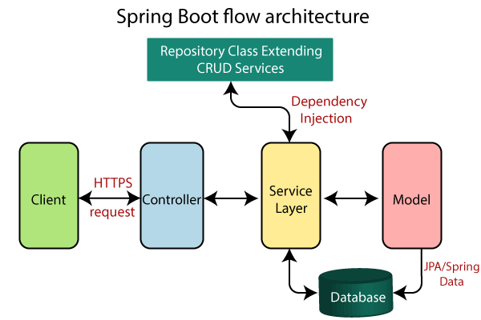
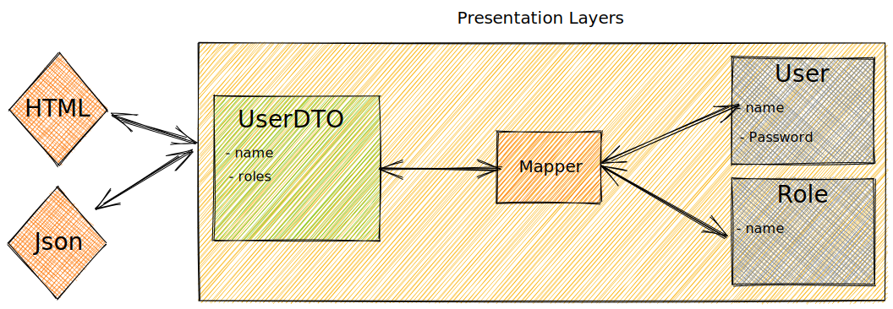
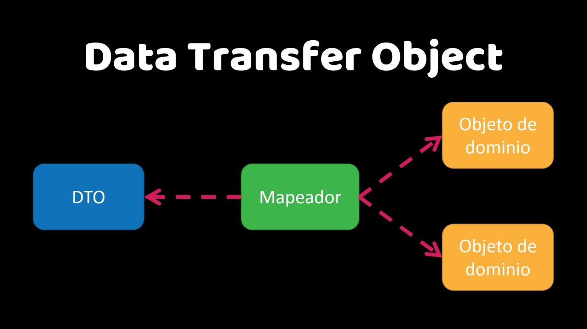

- [Servicios](#servicios)
  - [Manejo de Excepciones y errores](#manejo-de-excepciones-y-errores)
    - [ResponseStatusException](#responsestatusexception)
    - [Excepciones personalizadas](#excepciones-personalizadas)
    - [Visualizando las excepciones](#visualizando-las-excepciones)
  - [Cache](#cache)
  - [Patrón DTO](#patrón-dto)
  - [Mapeadores](#mapeadores)
  - [Validadores](#validadores)
    - [Jakarta Bean Validation](#jakarta-bean-validation)
- [Práctica de clase, Servicio](#práctica-de-clase-servicio)


# Servicios
Un servicios encapsula la lógica de negocio de nuestra app. De esta manera aplicamos el principio de responsabilidad única. Donde el controlador procesa las peticiones, y el servicio realiza las acciones necesarias para poder darle la respuesta.



Para ello vamos a crear nuestro servicio anotado con `@Service`y lo usaremos para procesar las peticiones requeridas por el controlador.

## Manejo de Excepciones y errores

### ResponseStatusException
Los errores se pueden manejar de dos formas: con excepciones. Desde la versión 5 de Spring, se puede usar [ResponseStatusException](https://www.baeldung.com/spring-response-status-exception). De esta forma, podemos lanzar una excepción y Spring se encarga de convertirla en un error HTTP en base al contenido que se le indica, dando la respuesta adecuada. 

```java
public class RaquetaValidator {

    public void validate(Raqueta raqueta) {
        // las distintas condiciones
        if (raqueta.getMarca() == null || raqueta.getMarca().isEmpty()) {
            throw new ResponseStatusException(
                    HttpStatus.BAD_REQUEST, "La marca no puede estar vacía");
        }
        if (raqueta.getModelo() == null || raqueta.getModelo().isEmpty()) {
            throw new ResponseStatusException(
                    HttpStatus.BAD_REQUEST, "El modelo no puede estar vacío");
        }
        if (raqueta.getPrecio() == null || raqueta.getPrecio() < 0) {
            throw new ResponseStatusException(
                    HttpStatus.BAD_REQUEST, "El precio no puede ser negativo");
        }
    }

}
```

```java
 @Override
public Raqueta findById(Long id) {
    log.info("findById");
    return raquetasRepository.findById(id).orElseThrow(
            () -> new ResponseStatusException(
                    HttpStatus.NOT_FOUND, "No se ha encontrado la raqueta con id: " + id)
    );
}
```

### Excepciones personalizadas
La otra opción es crear nuestras sistema de excepciones ye errores asociado al dominio. Para ello, vamos a crear una clase `RaquetaException` que herede de `RuntimeException` y que tenga un constructor con un mensaje. De esta forma, podemos lanzar una excepción y Spring se encarga de convertirla en un error HTTP en base al contenido que se le indica, dando la respuesta adecuada. El Response Stuatus lo definimos con una anotación. de esta manera nos es más sencillo testear y acotar las excepciones que se produzcan.

```java
// Nos permite devolver un estado cuando salta la excepción
@ResponseStatus(HttpStatus.NOT_FOUND)
public class TenistaNotFoundException extends TenistaException {
    // Por si debemos serializar
    @Serial
    private static final long serialVersionUID = 43876691117560211L;

    public TenistaNotFoundException(String mensaje) {
        super(mensaje);
    }
}
```

```java
public class TenistaService {

    public Tenista findById(Long id) {
        log.info("findById");
        return tenistaRepository.findById(id).orElseThrow(
                () -> new TenistaNotFoundException("No se ha encontrado el tenista con id: " + id)
        );
    }
}
```

### Visualizando las excepciones
Para mostrar los errores de forma correcta debemos añadir en nuestro fichero de propiedades la siguiente configuración:

```properties
# Para que muestre el mensaje de error de excepciones
server.error.include-message=always
```

## Cache
Para usar [cache](https://www.baeldung.com/spring-cache-tutorial) en Spring Boot, debemos añadir la dependencia de Spring Cache:

```kotlin
// Cache
implementation("org.springframework.boot:spring-boot-starter-cache")
```


Y añadir la anotación `@EnableCaching` en la clase principal (método main y anotada con` @SpringBootApplication`) de nuestra aplicación y en los servicios que queramos cachear añadimos la anotación `@CacheConfig` con el nombre de la cache que queramos usar. Aunque esto no es obligatorio, es recomendable usarlo para no tener que repetir el nombre de la cache en cada método. 
```java
@CacheConfig(cacheNames = {"raquetas"})
```

- @Cacheable: Se usa para indicar que un método es cachable. Si el método ya ha sido ejecutado, se devuelve el resultado de la cache. Si no, se ejecuta el método y se guarda el resultado en la cache. Se le puede indicar el nombre de la cache, el key y el tiempo de expiración. Se recomienda usar el key como identificador
- @CachePut: Se usa para indicar que un método es cachable. Si el método ya ha sido ejecutado, se ejecuta de nuevo y se guarda el resultado en la cache. Se le puede indicar el nombre de la cache, el key y el tiempo de expiración. Se recomienda usar result.key para la cache
- @CacheEvict: Se usa para indicar que un método es cachable. Si el método ya ha sido ejecutado, se elimina el resultado de la cache. Se le puede indicar el nombre de la cache, el key y el tiempo de expiración. Se recomienda usar el Key.

```java
@CacheConfig(cacheNames = {"raquetas"})
public RaquetasCacheado() {

    // ....

    public getRaquetas() {
        return raquetasRepository.findAll();
    }

    // Cachea con el id como key
    @Cacheable(key = "#id")
    public Raqueta findById(Long id) {
        //...
    }

    // Cachea con el id del resultado de la operación como key
   @CachePut(key = "#result.id") 
    public Raqueta save(Raqueta raqueta) {
        //...
    }

    // El key es opcional, si no se indica
    @CacheEvict(key = "#id")
    public void deleteById(Long id) {
        //...
    }

}
```

## Patrón DTO
Los [dto](https://www.oscarblancarteblog.com/2018/11/30/data-transfer-object-dto-patron-diseno/) son objetos que se usan para transportar datos entre capas. Se usan para evitar que se expongan las entidades de la base de datos o los modelos de nuestra aplicación, asi como se usan para ensamblar distintos objetos, eliminar campos que no queremos que se vean o pasar de un tipo de dato a otro. 



```java
public class RaquetaResponseDto {
    private final Long id;
    private final UUID uuid;
    private final String marca;
    private final String modelo;
    private final Double precio;
    private final String imagen;
}

```

## Mapeadores
Los mapeadores son clases que se encargan de convertir de un tipo de objeto a otro. En este caso, de un dto a un modelo de nuestra aplicación y viceversa. Podemos usar librerías para mapear como [ModelMapper](https://modelmapper.org/), o hacerlo nosotros mismos.



```java
public class RaquetaMapper {
    // Aquí iran los metodos para mapear los DTOs a los modelos y viceversa
    // Mapeamos de modelo a DTO
    public RaquetaResponseDto toResponse(Raqueta raqueta) {
        return new RaquetaResponseDto(
                raqueta.getId(),
                raqueta.getUuid(),
                raqueta.getMarca(),
                raqueta.getModelo(),
                raqueta.getPrecio(),
                raqueta.getImagen()

        );
    }

    // Mapeamos de DTO a modelo
    public List<RaquetaResponseDto> toResponse(List<Raqueta> raquetas) {
        return raquetas.stream()
                .map(this::toResponse)
                .toList();
    }
```

## Validadores
Los [validadores](https://www.baeldung.com/spring-boot-bean-validation) son clases que se encargan de validar los datos que nos llegan y lanzar excepciones en caso de que no sean correctos. 

Podemos crear una clase que se encargue de validar los datos de una raqueta:

```java
public class RaquetaValidator {

    public void validate(Raqueta raqueta) {
        if (raqueta.getMarca() == null || raqueta.getMarca().isBlank()) {
            throw new InvalidRaquetaException("La marca no puede ser nula o estar en blanco");
        }
        if (raqueta.getModelo() == null || raqueta.getModelo().isBlank()) {
            throw new InvalidRaquetaException("El modelo no puede ser nulo o estar en blanco");
        }
        if (raqueta.getPrecio() == null || raqueta.getPrecio() < 0) {
            throw new InvalidRaquetaException("El precio no puede ser nulo o negativo");
        }
    }
}
```

O podemos usar el sistema de validación de Spring, que nos permite validar los datos de una forma más sencilla. Para ello, debemos añadir la dependencia de Spring Validation:

```kotlin
// Validación
implementation("org.springframework.boot:spring-boot-starter-validation")
```


De esta manera podemos usar las anotaciones de validación de Spring:

```java
public class TenistaRequestDto {
    @NotBlank(message = "El nombre no puede estar vacío")
    private String nombre;
    @Min(value = 0, message = "El ranking no puede ser negativo")
    private Integer ranking;
    @NotBlank(message = "El país no puede estar vacío")
    private String pais;
    private String imagen;
    @Min(value = 0, message = "El id de la raqueta no puede ser negativo")
    private Long raquetaId; // Id de la raqueta, puede ser null
}
```

Ahora si queremos validar los datos de un dto, podemos usar `@Valid` en el parámetro del método:

```java
@PostMapping("")
public ResponseEntity<TenistaResponseDto> postTenista(
        @Valid @RequestBody TenistaRequestDto tenista
) {
    log.info("addTenista");
    return ResponseEntity.created(null).body(
            tenistaMapper.toResponse(
                    tenistasService.save(tenistaMapper.toModel(tenista)))
    );
}
```

No debes olvidar añadir un [handler](https://www.baeldung.com/spring-boot-bean-validation#the-exceptionhandler-annotation) anotado como @ExceptionHandler y el código de error para el error @ResponseStatus(HttpStatus.BAD_REQUEST) para capturar estas excepciones en tu controlador:

```java
 // Para capturar los errores de validación
@ResponseStatus(HttpStatus.BAD_REQUEST)
@ExceptionHandler(MethodArgumentNotValidException.class)
public Map<String, String> handleValidationExceptions(
        MethodArgumentNotValidException ex) {
    Map<String, String> errors = new HashMap<>();
    ex.getBindingResult().getAllErrors().forEach((error) -> {
        String fieldName = ((FieldError) error).getField();
        String errorMessage = error.getDefaultMessage();
        errors.put(fieldName, errorMessage);
    });
    return errors;
}
```

### Jakarta Bean Validation
Son los [validadores](https://docs.jboss.org/hibernate/stable/validator/reference/en-US/html_single/#validator-defineconstraints-spec) que podemos usar en Spring. Aquí tienes los más importantes.

| Restricción | Descripción |
| --- | --- |
| @Null | El elemento debe ser nulo. |
| @NotNull | El elemento no debe ser nulo. |
| @AssertTrue | El elemento debe ser verdadero. |
| @AssertFalse | El elemento debe ser falso. |
| @Min | El elemento debe ser un número cuyo valor sea mayor o igual al mínimo especificado. |
| @Max | El elemento debe ser un número cuyo valor sea menor o igual al máximo especificado. |
| @DecimalMin | El elemento debe ser un número cuyo valor sea mayor o igual al mínimo especificado. |
| @DecimalMax | El elemento debe ser un número cuyo valor sea menor o igual al máximo especificado. |
| @Negative | El elemento debe ser un número estrictamente negativo (es decir, se considera que 0 es un valor inválido). |
| @NegativeOrZero | El elemento debe ser un número negativo o cero. |
| @Positive | El elemento debe ser un número estrictamente positivo (es decir, se considera que 0 es un valor inválido). |
| @PositiveOrZero | El elemento debe ser un número positivo o cero. |
| @Size | El tamaño del elemento debe estar entre los límites especificados (incluidos). |
| @Digits | El elemento debe ser un número dentro del rango aceptado. |
| @Past | El elemento debe ser una fecha, hora o instante en el pasado. |
| @PastOrPresent | El elemento debe ser una fecha, hora o instante en el pasado o en el presente. |
| @Future | El elemento debe ser una fecha, hora o instante en el futuro. |
| @FutureOrPresent | El elemento debe ser una fecha, hora o instante en el presente o en el futuro. |
| @Pattern | El elemento anotado debe coincidir con la expresión regular especificada. |
| @NotEmpty | El elemento anotado no debe ser nulo ni vacío. |
| @NotBlank | El elemento anotado no debe ser nulo y debe contener al menos un carácter que no sea un espacio en blanco. |
| @Email | La cadena debe ser una dirección de correo electrónico bien formada. |

# Práctica de clase, Servicio

1. Crea un servicio con cache para manejar tu repositorio de Funkos
2. Crea un sistema de excepciones para las operaciones más comunes para el manejo de Funkos
3. Usa DTOs para crear y actualizar Funkos u obtener las respuestas.
4. Crea un mapeador para convertir de DTO a modelo y viceversa
5. Crea un validador para validar los datos de los DTOs
6. Prueba las rutas con Postman

