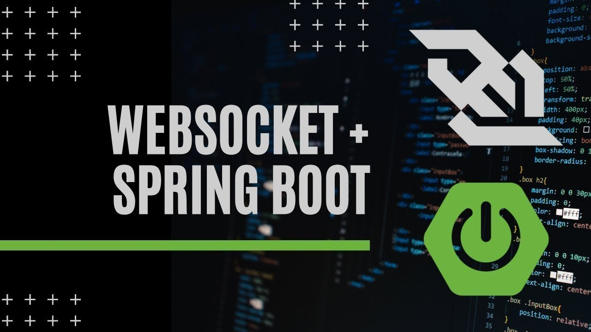

- [WebSocket](#websocket)
  - [Instalando y Configurando WebSockets](#instalando-y-configurando-websockets)
  - [Implementando envío de notificaciones a clientes](#implementando-envío-de-notificaciones-a-clientes)
- [Práctica de clase, Notificaciones con Websockets](#práctica-de-clase-notificaciones-con-websockets)
- [Proyecto del curso](#proyecto-del-curso)



# WebSocket
Un WebSocket es un protocolo de comunicación bidireccional en tiempo real que se establece entre un cliente y un servidor a través de una conexión TCP (Transmission Control Protocol). A diferencia del protocolo HTTP (Hypertext Transfer Protocol), que sigue un modelo de solicitud-respuesta, los WebSockets permiten una comunicación continua y bidireccional entre el cliente y el servidor.

Los WebSockets se utilizan en servicios web para habilitar la comunicación en tiempo real entre el cliente y el servidor. Anteriormente, para lograr una comunicación en tiempo real, se utilizaban técnicas como la "polling" o "long polling", donde el cliente enviaba repetidamente solicitudes al servidor para verificar si había alguna actualización disponible. Esto generaba una carga adicional tanto en el cliente como en el servidor.

Con los WebSockets, se establece una conexión persistente entre el cliente y el servidor, lo que permite que los dos extremos se comuniquen de manera eficiente y en tiempo real. Una vez que se establece la conexión WebSocket, tanto el cliente como el servidor pueden enviar mensajes en cualquier momento sin necesidad de esperar una solicitud explícita.

Los WebSockets son ampliamente utilizados en aplicaciones web que requieren actualizaciones en tiempo real, como notificaciones, chats en línea, juegos multijugador, aplicaciones de colaboración en tiempo real y paneles de control en tiempo real. Proporcionan una forma eficiente y escalable de mantener una comunicación bidireccional entre el cliente y el servidor, lo que mejora la experiencia del usuario y permite la implementación de aplicaciones web más interactivas y dinámicas.


## Instalando y Configurando WebSockets
Para configurar los web socket necesitamos una clase de configuración donde definamos los endpoints de los web sockets y el manejador que se encargará de atenderlos. 

```java
@Configuration
@EnableWebSocket
public class WebSocketConfig implements WebSocketConfigurer {

    @Value("${api.version}")
    private String apiVersion;

    // Registra uno por cada tipo de notificación que quieras con su handler y su ruta (endpoint)
    // Cuidado con la ruta que no se repita
    // Para coinectar con el cliente, el cliente debe hacer una petición de conexión
    // ws://localhost:3000/ws/v1/productos
    @Override
    public void registerWebSocketHandlers(WebSocketHandlerRegistry registry) {
        registry.addHandler(webSocketProductosHandler(), "/ws/" + apiVersion + "/productos");
    }

    // Cada uno de los handlers como bean para que cada vez que nos atienda
    @Bean
    public WebSocketHandler webSocketRaquetasHandler() {
        return new WebSocketHandler("Productos");
    }

}
```

Posteriormente podemos definir ese Handler con los métodos para enviar o recibir mensajes. Se puede aplicar un patrón Observer para transmitir los mensajes a los clientes conectados.

```java
@Slf4j
public class WebSocketHandler extends TextWebSocketHandler implements SubProtocolCapable, WebSocketSender {
    private final String entity; // Entidad que se notifica

    // Sesiones de los clientes conectados, para recorrelos y enviarles mensajes (patrón observer)
    // es concurrente porque puede ser compartida por varios hilos
    private final Set<WebSocketSession> sessions = new CopyOnWriteArraySet<>();

    public WebSocketHandler(String entity) {
        this.entity = entity;
    }

    /**
     * Cuando se establece la conexión con el servidor
     *
     * @param session Sesión del cliente
     * @throws Exception Error al establecer la conexión
     */
    @Override
    public void afterConnectionEstablished(WebSocketSession session) throws Exception {
        log.info("Conexión establecida con el servidor");
        log.info("Sesión: " + session);
        sessions.add(session);
        TextMessage message = new TextMessage("Updates Web socket: " + entity + " - Tienda API Spring Boot");
        log.info("Servidor envía: {}", message);
        session.sendMessage(message);
    }

    /**
     * Cuando se cierra la conexión con el servidor
     *
     * @param session Sesión del cliente
     * @param status  Estado de la conexión
     * @throws Exception Error al cerrar la conexión
     */
    @Override
    public void afterConnectionClosed(WebSocketSession session, CloseStatus status) throws Exception {
        log.info("Conexión cerrada con el servidor: " + status);
        sessions.remove(session);
    }

    /**
     * Envía un mensaje a todos los clientes conectados
     *
     * @param message Mensaje a enviar
     * @throws IOException Error al enviar el mensaje
     */
    @Override
    public void sendMessage(String message) throws IOException {
        log.info("Enviar mensaje de cambios en la entidad: " + entity + " : " + message);
        // Enviamos el mensaje a todos los clientes conectados
        for (WebSocketSession session : sessions) {
            if (session.isOpen()) {
                log.info("Servidor WS envía: " + message);
                session.sendMessage(new TextMessage(message));
            }
        }
    }

    /**
     * Envía mensajes periódicos a los clientes conectados para que sepan que el servidor sigue vivo
     *
     * @throws IOException Error al enviar el mensaje
     */
    @Scheduled(fixedRate = 1000) // Cada segundo
    @Override
    public void sendPeriodicMessages() throws IOException {
        for (WebSocketSession session : sessions) {
            if (session.isOpen()) {
                String broadcast = "server periodic message " + LocalTime.now();
                log.info("Server sends: " + broadcast);
                session.sendMessage(new TextMessage(broadcast));
            }
        }
    }

    /**
     * Maneja los mensajes de texto que le llegan al servidor, en este caso no hacemos nada porque no nos interesa
     * ya que el servidor no recibe mensajes de los clientes, solo les envía mensajes
     *
     * @param session
     * @param message
     * @throws Exception
     */
    @Override
    protected void handleTextMessage(WebSocketSession session, TextMessage message) throws Exception {
        // No hago nada con los mensajes que me llegan
        // Si quisieramos un chat, por ejemplo, aquí lo gestionaríamos,
        // leeríamos el mensaje y lo enviaríamos a todos los clientes conectados
        /*
        String request = message.getPayload();
        log.info("Server received: " + request);
        String response = String.format("response from server to '%s'", HtmlUtils.htmlEscape(request));
        log.info("Server sends: " + response);
        session.sendMessage(new TextMessage(response));
        */
    }

    /**
     * Maneja los errores de transporte que le llegan al servidor
     *
     * @param session   Sesión del cliente
     * @param exception Excepción que se ha producido
     * @throws Exception Error al manejar el error
     */
    @Override
    public void handleTransportError(WebSocketSession session, Throwable exception) throws Exception {
        log.info("Error de transporte con el servidor: " + exception.getMessage());
    }

    /**
     * Devuelve los subprotocolos que soporta el servidor
     *
     * @return Lista de subprotocolos
     */
    @Override
    public List<String> getSubProtocols() {
        return List.of("subprotocol.demo.websocket");
    }
}
```

## Implementando envío de notificaciones a clientes
Posteriormente en el servicio donde queramos enviar una notificación, usando nuestro WebSocket podemos hacer lo siguiente:

```java
 //...

@Override
@CachePut
public Producto save(ProductoCreateDto productoCreateDto) {
    log.info("Guardando producto: " + productoCreateDto);
    // Buscamos la categoría por su nombre
    var categoria = categoriaService.findByNombre(productoCreateDto.getCategoria());
    // Creamos el producto nuevo con los datos que nos vienen del dto, podríamos usar el mapper
    // Lo guardamos en el repositorio
    var productoSaved = productosRepository.save(productosMapper.toProduct(productoCreateDto, categoria));
    // Enviamos la notificación a los clientes ws
    onChange(Notificacion.Tipo.CREATE, productoSaved);
    // Devolvemos el producto guardado
    return productoSaved;
}

//...

void onChange(Notificacion.Tipo tipo, Producto data) {
    log.debug("Servicio de productos onChange con tipo: " + tipo + " y datos: " + data);

    if (webSocketService == null) {
        log.warn("No se ha podido enviar la notificación a los clientes ws, no se ha encontrado el servicio");
        webSocketService = this.webSocketConfig.webSocketRaquetasHandler();
    }

    try {
        Notificacion<ProductoNotificationDto> notificacion = new Notificacion<>(
                "PRODUCTOS",
                tipo,
                productoNotificationMapper.toProductNotificationDto(data),
                LocalDateTime.now().toString()
        );

        String json = mapper.writeValueAsString((notificacion));

        log.info("Enviando mensaje a los clientes ws");
        // Enviamos el mensaje a los clientes ws con un hilo, si hay muchos clientes, puede tardar
        // no bloqueamos el hilo principal que atiende las peticiones http
        Thread senderThread = new Thread(() -> {
            try {
                webSocketService.sendMessage(json);
            } catch (Exception e) {
                log.error("Error al enviar el mensaje a través del servicio WebSocket", e);
            }
        });
        senderThread.start();
    } catch (JsonProcessingException e) {
        log.error("Error al convertir la notificación a JSON", e);
    }
}
```

# Práctica de clase, Notificaciones con Websockets

1. Crea un sistema de notificaciones para recibir los cambios sobre Funkos, especialmente cuando se crea un funko nuevo, o se modifica o borra uno existente.
2. Testea los repositorios, servicios y controladores con la nueva funcionalidad.

# Proyecto del curso
Puedes encontrar el proyecto con lo visto hasta este punto en la etiqueta: [v.0.0.4 del repositorio del curso: websockets_notificaciones](https://github.com/joseluisgs/DesarrolloWebEntornosServidor-02-Proyecto-2023-2024/releases/tag/websockets_notificaciones).


