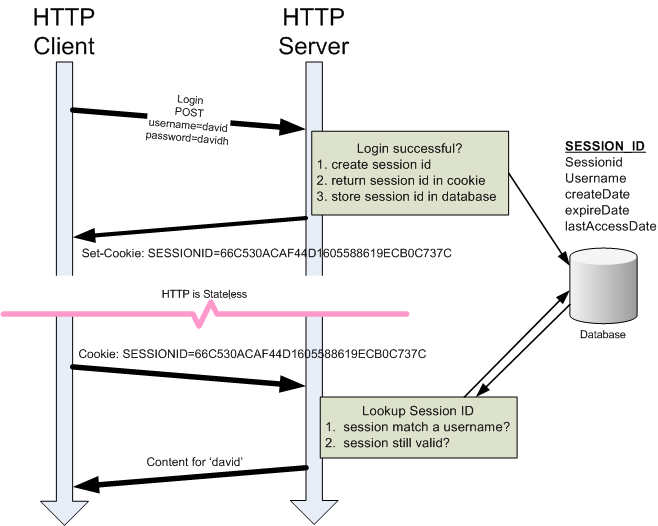

- [Patrón MVC (Modelo-Vista-Controlador)](#patrón-mvc-modelo-vista-controlador)
  - [Patrón MVC en Spring Boot](#patrón-mvc-en-spring-boot)
- [Thymeleaf](#thymeleaf)
  - [Instalación y configuración](#instalación-y-configuración)
  - [Elementos de Thymeleaf](#elementos-de-thymeleaf)
    - [Texto](#texto)
    - [Expresiones](#expresiones)
    - [Condicionales](#condicionales)
    - [Iteraciones](#iteraciones)
    - [Fragmentos](#fragmentos)
    - [Enlaces y formularios](#enlaces-y-formularios)
    - [Llamadas al controlador](#llamadas-al-controlador)
    - [Mas opciones](#mas-opciones)
  - [La carpeta Static](#la-carpeta-static)
  - [Instalando otras librerías](#instalando-otras-librerías)
    - [Usando webjars](#usando-webjars)
    - [Usando statics](#usando-statics)
      - [Consideraciones con static y rutas relativas](#consideraciones-con-static-y-rutas-relativas)
  - [Sesiones](#sesiones)
    - [Profundizando en las sesiones](#profundizando-en-las-sesiones)
    - [HttpSession](#httpsession)
    - [Usando Spring](#usando-spring)
    - [Ambas](#ambas)
  - [CRUD](#crud)
    - [Ejemplo](#ejemplo)
- [Práctica de clase:  Thymeleaf](#práctica-de-clase--thymeleaf)
- [Proyecto del curso](#proyecto-del-curso)


# Patrón MVC (Modelo-Vista-Controlador)
El	modelo	vista	controlador	(MVC)	separa	los	datos	y	la	lógica	de	negocio	de	una	
aplicación	de	la	interfaz	de	usuario.	

Anteriormente hemos visto como "la vista" quedaba difuminada en Peticiones y Respuestas en JSON y esta se trasladaba al cliente.

Pero con Spring Boot podemos hacer páginas web dinámicas gracias a sus motores de plantillas como son: [Thymeleaf](https://www.thymeleaf.org), [Freemaker](https://freemarker.apache.org/index.html) o [Mustache](https://mustache.github.io/).

## Patrón MVC en Spring Boot
- Modelo: El modelo puede contener objetos, estructuras de datos, variables y cualquier otra información relevante para la generación de la página web. Su objetivo principal es proporcionar los datos necesarios para que la vista pueda mostrar la información de manera adecuada al usuario. El modelo se refiere a la información que será visualizada en la página web. Esto incluye los datos que se obtienen de la base de datos u otros servicios, y que luego son procesados y preparados para su presentación en la vista.
- Controladores: Los controladores son clases en Java que se encargan de manejar las solicitudes web. Su función principal es procesar los datos recibidos en la solicitud, como los parámetros. Además, realizan peticiones a la base de datos, utilizan diversos servicios y realizan otras tareas. También definen la información que se mostrará en la página web, conocida como el modelo. Por último, determinan qué vista será responsable de generar la página HTML.
- Vistas: En Spring MVC, las vistas se implementan como plantillas HTML. Estas vistas generan HTML utilizando una plantilla y la información proporcionada por el controlador (modelo). Existen diferentes tecnologías de plantillas que se pueden utilizar con Spring MVC, como JSP, Thymeleaf, FreeMarker, entre otras. En este caso, se utilizará Thymeleaf como tecnología de plantillas.

# Thymeleaf
[Thymeleaf](https://www.thymeleaf.org/doc/tutorials/3.1/usingthymeleaf.html)	permite	realizar	la	maquetación	HTML	sin	necesidad	de	que	intervenga	el	servidor, es decir, Thymeleaf	se	diferencia	de	las	demás	en	que	las	plantillas	son	ficheros	 HTML	válidos que	pueden	verse	en	un	navegador	sin	necesidad	de	servidor	 web	(natural	templating).	Esta	característica	es	ideal	para	la	separación	de	roles:	diseñadores	y	
desarrolladores. Thymeleaf	está	totalmente	Integrado	con	Spring	(MVC,	Security).

## Instalación y configuración
Paso 1: Debemos instalar la dependencias y starter de Thymeleaf
```kotlin
implementation("org.springframework.boot:spring-boot-starter-thymeleaf")
```
Paso 2: Configurar Thymeleaf en la aplicación Spring Boot
- Opcionalmente podemos agregar la siguiente configuración en el archivo `application.properties`:

```
spring.thymeleaf.enabled=true
spring.thymeleaf.prefix=classpath:/templates/
spring.thymeleaf.suffix=.html
```

Esto configura Thymeleaf para que busque las plantillas HTML en la carpeta `templates/` dentro del classpath de la aplicación.

Paso 3: Crear una plantilla HTML con Thymeleaf
- Crea un archivo HTML en la carpeta `templates/`. Por ejemplo, `index.html`.
- Agrega el siguiente código HTML básico:

```html
<!DOCTYPE html>
<html xmlns:th="http://www.thymeleaf.org">
<head>
    <title>My Application</title>
</head>
<body>
    <h1>Welcome to My Application</h1>
    <p th:text="'Hello, ' + ${name} + '!'"></p>
</body>
</html>
```

Este código utiliza la sintaxis de Thymeleaf para mostrar un saludo personalizado utilizando una variable `name`.

Paso 4: Crear un controlador para procesar las solicitudes
- Crea una clase `HomeController` en tu paquete de controladores.
- Anota la clase con `@Controller` para indicar que es un controlador de Spring MVC.
- Crea un método `index` dentro del controlador para manejar la solicitud de la página principal. Por ejemplo:

```java
@Controller
public class HomeController {
    
    @GetMapping("/")
    public String index(Model model) {
        model.addAttribute("name", "John");
        return "index";
    }
}
```

Este método utiliza la anotación `@GetMapping("/")` para mapear la URL raíz ("/") a este método. Luego, agrega el atributo `name` al modelo y devuelve el nombre de la plantilla HTML que se debe renderizar, en este caso, "index".

Paso 5: Ejecutar la aplicación
- Ejecuta la aplicación de Spring Boot.
- Abre un navegador y visita `http://localhost:8080/`. Deberías ver la página principal con el saludo personalizado.

¡Felicidades! Has creado una aplicación básica de Spring Boot con Thymeleaf. Ahora puedes ampliarla para implementar un CRUD completo.

Para implementar las operaciones CRUD y sus respectivas páginas web, puedes seguir estos pasos adicionales:

Paso 6: Crear las plantillas HTML para las páginas de CRUD
- Crea las plantillas HTML necesarias para las páginas de listado, creación, actualización y eliminación de registros. Por ejemplo, `list.html`, `create.html`, `update.html` y `delete.html`.

Paso 7: Crear los métodos del controlador para procesar las solicitudes CRUD
- Crea los métodos necesarios en el controlador para manejar las solicitudes de listado, creación, actualización y eliminación de registros. Utiliza las anotaciones `@GetMapping`, `@PostMapping`, `@PutMapping` y `@DeleteMapping` según corresponda.

Paso 8: Implementar la lógica del CRUD
- En los métodos del controlador, implementa la lógica para interactuar con la capa de persistencia de datos (por ejemplo, una base de datos) utilizando servicios y repositorios.

Paso 9: Mapear las plantillas HTML a los métodos del controlador
- En cada método del controlador, devuelve el nombre de la plantilla HTML correspondiente para que se renderice.

Con estos pasos, habrás creado un controlador para procesar un CRUD completo con Thymeleaf y Spring Boot. Recuerda que este es solo un tutorial básico para darte una idea de cómo comenzar. Puedes personalizar y ampliar la aplicación según tus necesidades específicas.

## Elementos de Thymeleaf
La	sintaxis	de	las	plantillas	Thymeleaf	se	define	en	las	
páginas	HTML	mediante	la	etiqueta	`th` Los	navegadores	ignorarán	el	espacio	de	nombre	que	no	
entienden	(th)	con	lo	que	la	página	seguirá	siendo	válida. El atributo xmlns define el espacio de
nombres (XML Namespace) para th. Un espacio de nombres permite definir nombres de elementos y atributos únicos en un documento XML (o HTML). 

```html
<!DOCTYPE html>
<html xmlns:th="http://www.thymeleaf.org">
  <body>
    <p>Hello <span th:text="${name}"></span></p>
  </body>
</html> 
```

### Texto

Para	mostrar	texto	en	la	plantilla	usamos	la	etiqueta	`th:text`
  
```html
<p th:text="${name}">Name</p>
```

Claro, aquí tienes una descripción de los elementos más importantes en Thymeleaf:

### Expresiones
Thymeleaf utiliza expresiones para acceder y manipular datos en las plantillas HTML. Algunos ejemplos de expresiones son:

   - `${variable}`: Accede al valor de una variable.
   - `*{property}`: Accede a una propiedad de un objeto.
   - `@{url}`: Genera una URL relativa.
   - `#{message}`: Recupera un mensaje internacionalizado.

```html
<!DOCTYPE html>
<html xmlns:th="http://www.thymeleaf.org">
<head>
    <title>Ejemplo Thymeleaf</title>
</head>
<body>
    <h1>Bienvenido, <span th:text="${nombre}"></span>!</h1>
    
    <p>Tu saldo actual es: <span th:text="${saldo}"></span> USD</p>
    
    <a th:href="@{/productos/${id}}">Ver detalles del producto</a>
    
    <p>Mensaje internacionalizado: <span th:text="#{saludo}"></span></p>
</body>
</html>
```

En este ejemplo, se utilizan diferentes expresiones de Thymeleaf. `${nombre}` accede al valor de la variable `nombre` y lo muestra en el texto del `<span>`. `${saldo}` accede al valor de la variable `saldo` y lo muestra en el texto del `<span>`. `@{/productos/${id}}` genera una URL relativa para acceder a los detalles de un producto, donde `id` es una variable. `#{saludo}` recupera un mensaje internacionalizado con la clave "saludo" y lo muestra en el texto del `<span>`.


### Condicionales
Puedes utilizar condicionales en Thymeleaf para mostrar u ocultar contenido en función de una condición. Algunos ejemplos son:

   - `th:if`: Muestra el contenido si la condición es verdadera.
   - `th:unless`: Muestra el contenido si la condición es falsa.
   - `th:switch`: Define un bloque de selección múltiple.
   - `th:case`: Define un caso dentro de un bloque `th:switch`.

```html
<!DOCTYPE html>
<html xmlns:th="http://www.thymeleaf.org">
<head>
    <title>Ejemplo Thymeleaf</title>
</head>
<body>
    <h1>Bienvenido, <span th:text="${nombre}"></span>!</h1>
    
    <p th:if="${saldo > 0}">Tu saldo actual es positivo.</p>
    <p th:unless="${saldo > 0}">Tu saldo actual es negativo o cero.</p>
    
    <div th:switch="${tipo}">
        <p th:case="'admin'">Eres un administrador.</p>
        <p th:case="'usuario'">Eres un usuario regular.</p>
        <p th:case="'invitado'">Eres un invitado.</p>
        <p th:case="*">No se reconoce tu tipo.</p>
    </div>
</body>
</html>
```

En este ejemplo, se utiliza `th:if` para mostrar el contenido del primer `<p>` si la condición `${saldo > 0}` es verdadera, es decir, si el saldo es mayor a cero. Por otro lado, se utiliza `th:unless` para mostrar el contenido del segundo `<p>` si la condición `${saldo > 0}` es falsa, es decir, si el saldo es igual o menor a cero.

Además, se utiliza `th:switch` para definir un bloque de selección múltiple basado en la variable `${tipo}`. Dentro de este bloque, se utilizan `th:case` para definir diferentes casos. Dependiendo del valor de `${tipo}`, se mostrará el contenido correspondiente al caso coincidente. Si no se encuentra ningún caso coincidente, se muestra el contenido del caso `*`, que actúa como un caso por defecto.

### Iteraciones
Thymeleaf proporciona bucles para iterar sobre colecciones de datos. Algunos ejemplos son:

   - `th:each`: Itera sobre una colección y proporciona una variable de iteración.
   - `th:unless`: Itera sobre una colección y muestra el contenido si la colección está vacía.

```html
<!DOCTYPE html>
<html xmlns:th="http://www.thymeleaf.org">
<head>
    <title>Ejemplo Thymeleaf</title>
</head>
<body>
    <h1>Lista de productos:</h1>
    
    <ul>
        <li th:each="producto : ${productos}">
            <span th:text="${producto.nombre}"></span> - <span th:text="${producto.precio}"></span> USD
        </li>
        <li th:unless="${productos}">
            No hay productos disponibles.
        </li>
    </ul>
</body>
</html>
```

En este ejemplo, se utiliza `th:each` para iterar sobre la colección `${productos}`. En cada iteración, se asigna el elemento actual a la variable de iteración `producto`. Dentro del `<li>`, se accede a las propiedades `nombre` y `precio` de cada `producto` para mostrar la información correspondiente.

Además, se utiliza `th:unless="${productos}"` para mostrar el contenido del segundo `<li>` si la colección `${productos}` está vacía. En este caso, se muestra el mensaje "No hay productos disponibles".

Con estas expresiones, es posible iterar sobre una colección y mostrar su contenido, así como mostrar un mensaje alternativo en caso de que la colección esté vacía.

### Fragmentos
Puedes definir fragmentos reutilizables de código HTML en Thymeleaf utilizando la directiva `th:fragment`. Luego, puedes incluir esos fragmentos en otras partes de la plantilla utilizando `th:insert` o `th:replace`.

```html
<!DOCTYPE html>
<html xmlns:th="http://www.thymeleaf.org">
<head>
    <title>Ejemplo Thymeleaf</title>
</head>
<body>
    <header>
        <div th:fragment="navbar">
            <nav>
                <!-- Contenido de la barra de navegación -->
            </nav>
        </div>
    </header>
    
    <main>
        <div th:insert="fragments/navbar :: navbar"></div>
        
        <section>
            <h1>Página principal</h1>
            <!-- Contenido de la página principal -->
        </section>
    </main>
    
    <footer>
        <div th:replace="fragments/navbar :: navbar"></div>
        <!-- Contenido del pie de página -->
    </footer>
</body>
</html>
```

En este ejemplo, se define un fragmento de código HTML llamado `navbar` utilizando `th:fragment`. Este fragmento representa la barra de navegación de la página. Luego, se utiliza `th:insert` para incluir el fragmento `navbar` en el `<div>` dentro del `<main>`, lo que muestra la barra de navegación en esa sección de la página.

Además, se utiliza `th:replace` para reemplazar el contenido del `<div>` dentro del `<footer>` con el fragmento `navbar`, lo que muestra la barra de navegación también en el pie de página.

De esta manera, puedes definir fragmentos reutilizables de código HTML y luego incluirlos en diferentes partes de la plantilla utilizando `th:insert` o `th:replace`, lo que facilita la reutilización y mantenimiento del código.

### Enlaces y formularios
Thymeleaf facilita la generación de enlaces y formularios en las plantillas HTML. Algunos ejemplos son:

   - `th:href`: Genera una URL en un enlace.
   - `th:action`: Especifica la URL de destino en un formulario.
   - `th:field`: Vincula un campo de formulario a una propiedad de un objeto.

Aquí tienes un ejemplo de HTML donde se utilizan las expresiones `th:href`, `th:action` y `th:field` de Thymeleaf:

```html
<!DOCTYPE html>
<html xmlns:th="http://www.thymeleaf.org">
<head>
    <title>Ejemplo Thymeleaf</title>
</head>
<body>
    <h1>Formulario de registro</h1>
    
    <form th:action="@{/registro}" method="post">
        <label for="nombre">Nombre:</label>
        <input type="text" id="nombre" th:field="${usuario.nombre}" />
        
        <label for="email">Email:</label>
        <input type="email" id="email" th:field="${usuario.email}" />
        
        <button type="submit">Registrarse</button>
    </form>
    
    <a th:href="@{/inicio}">Volver al inicio</a>
</body>
</html>
```

En este ejemplo, se utiliza `th:action` en el formulario para especificar la URL de destino cuando se envía el formulario. En este caso, la URL de destino es `@{/registro}`, lo que significa que el formulario se enviará a la ruta `/registro` del servidor.

Además, se utiliza `th:href` en el enlace para generar una URL en el atributo `href`. En este caso, la URL generada es `@{/inicio}`, lo que significa que el enlace apunta a la ruta `/inicio` del servidor.

En cuanto a `th:field`, se utiliza para vincular los campos de formulario (`<input>`) a propiedades de un objeto. En este ejemplo, se utiliza `th:field="${usuario.nombre}"` y `th:field="${usuario.email}"` para vincular los campos de nombre y email respectivamente a las propiedades `nombre` y `email` del objeto `usuario`.

Estas expresiones permiten generar URLs en enlaces, especificar URLs de destino en formularios y vincular campos de formulario a propiedades de objetos de manera conveniente utilizando Thymeleaf.

### Llamadas al controlador
Puedes llamar a métodos de controlador desde las plantillas Thymeleaf utilizando diversas directivas, como:

   - `@{url}`: Genera una URL relativa para una solicitud GET.
   - `th:action`: Especifica la URL de destino para una solicitud POST.
   - `th:object`: Asocia un objeto a un formulario para la vinculación de datos.

```html
<!DOCTYPE html>
<html xmlns:th="http://www.thymeleaf.org">
<head>
    <title>Ejemplo Thymeleaf</title>
</head>
<body>
    <h1>Formulario de envío</h1>
    
    <form th:action="@{/enviar}" method="post" th:object="${mensaje}">
        <label for="destinatario">Destinatario:</label>
        <input type="text" id="destinatario" th:field="*{destinatario}" />
        
        <label for="asunto">Asunto:</label>
        <input type="text" id="asunto" th:field="*{asunto}" />
        
        <label for="contenido">Contenido:</label>
        <textarea id="contenido" th:field="*{contenido}"></textarea>
        
        <button type="submit">Enviar</button>
    </form>
    
    <a th:href="@{/inicio}">Volver al inicio</a>
</body>
</html>
```

En este ejemplo, se utiliza `th:action` en el formulario para especificar la URL de destino cuando se envía el formulario. En este caso, la URL de destino es `@{/enviar}`, lo que significa que el formulario se enviará a la ruta `/enviar` del servidor.

Además, se utiliza `th:object` en el formulario para asociar el objeto `mensaje` al formulario. Esto permite la vinculación de datos entre los campos del formulario y las propiedades del objeto `mensaje`. Por ejemplo, `th:field="*{destinatario}"` vincula el campo de destinatario al atributo `destinatario` del objeto `mensaje`.

En cuanto a `@{url}`, se utiliza para generar una URL relativa en un enlace. En este ejemplo, `th:href="@{/inicio}"` generará una URL relativa que apunta a la ruta `/inicio` del servidor.

Estas expresiones de Thymeleaf facilitan la generación de URLs, especificación de URLs de destino y vinculación de datos entre formularios y objetos en el desarrollo de aplicaciones web.


### Mas opciones
Estos son solo algunos ejemplos de los elementos más importantes en Thymeleaf. La documentación oficial de [Thymeleaf](https://www.thymeleaf.org/documentation.html) proporciona una guía completa con más detalles y ejemplos sobre el uso de estas características, entre ellas la localicación, el operador elvis, calendarios, eyc.

## La carpeta Static
En Spring Boot, la carpeta "static" se utiliza para almacenar recursos estáticos que serán servidos directamente por el servidor web incorporado en Spring Boot, como por ejemplo HTML, CSS, JavaScript, imágenes u otros archivos estáticos.

Cuando se coloca un archivo en la carpeta "static" dentro de un proyecto de Spring Boot, este archivo se considera parte del contenido estático de la aplicación y está disponible públicamente a través de la URL base de la aplicación.

Por ejemplo, si tienes un archivo "style.css" ubicado en la carpeta "static/css" de tu proyecto, podrás acceder a él a través de la URL `http://localhost:8080/css/style.css` si estás ejecutando la aplicación localmente en el puerto 8080.

La carpeta "static" es útil para almacenar recursos estáticos que no requieren procesamiento adicional por parte del servidor, como archivos HTML, imágenes o archivos CSS y JavaScript. Al utilizar esta carpeta, puedes organizar y servir fácilmente tus recursos estáticos en una aplicación Spring Boot.

## Instalando otras librerías

### Usando webjars
A parte de usar CDN para usar determinadas librerías, cosa que podemos hacer sin problemas instalando. Por ejemplo si queremos usar Bootstrap, podemos instalarlo con:

```kotlin
implementation("org.webjars:bootstrap:5.3.0")
```
<!DOCTYPE html>
<html xmlns:th="http://www.thymeleaf.org">
<head>
    <title>Ejemplo Bootstrap con Thymeleaf</title>
    <link rel="stylesheet" th:href="@{/webjars/bootstrap/5.3.0/css/bootstrap.min.css}" />
</head>
<body>
    <h1>Hola mundo con Bootstrap</h1>
    
    <!-- Aquí puedes utilizar los componentes y estilos de Bootstrap -->
    
    <script th:src="@{/webjars/bootstrap/5.3.0/js/bootstrap.min.js}"></script>
</body>
</html>

### Usando statics 
Para instalar y utilizar una librería JavaScript u otras en Thymeleaf, puedes seguir los siguientes pasos:

1. Descarga la librería JavaScript que deseas utilizar desde su fuente oficial o desde un repositorio de paquetes.

2. Coloca el archivo de la librería JavaScript descargado en la ubicación adecuada dentro de tu proyecto Thymeleaf. Por lo general, se recomienda colocar los archivos JavaScript en el directorio "static/js" o "resources/static/js".

3. En tu archivo HTML de Thymeleaf, asegúrate de tener la etiqueta `<script>` en el lugar donde deseas utilizar la librería JavaScript. Por ejemplo:

```html
<!DOCTYPE html>
<html xmlns:th="http://www.thymeleaf.org">
<head>
    <!-- Tus otras etiquetas de encabezado -->
</head>
<body>
    <!-- Contenido de tu página -->
    
    <script src="/js/tu-libreria.js"></script>
</body>
</html>
```

Asegúrate de reemplazar "tu-libreria.js" con el nombre del archivo de la librería JavaScript que has descargado.

4. Ahora puedes utilizar las funciones y características proporcionadas por la librería JavaScript en tu archivo HTML de Thymeleaf. Puedes seguir la documentación de la librería para obtener más detalles sobre cómo utilizarla.

Recuerda que Thymeleaf es un motor de plantillas que se ejecuta en el lado del servidor, por lo que cualquier interacción con la librería JavaScript se realizará en el lado del cliente, una vez que el navegador haya cargado y esté ejecutando el código JavaScript.

#### Consideraciones con static y rutas relativas
¿Qué diferencia hay entre?

```html


```	

La diferencia entre las dos etiquetas `` es cómo se especifica la ruta de la imagen a partir de static.

En el primer caso, ``, se utiliza la ruta absoluta para la imagen. La ruta "/images/thymeleaf.png" indica que la imagen se encuentra en la carpeta "images" en la raíz del servidor. Esta ruta no se modifica ni se interpreta por Thymeleaf, es simplemente una ruta estática.

En el segundo caso, ``, se utiliza la sintaxis de Thymeleaf para especificar la ruta de la imagen. La expresión `@{/images/thymeleaf.png}` es una expresión de Thymeleaf que se evaluará en tiempo de ejecución y generará la ruta correcta hacia la imagen. Thymeleaf interpretará esta expresión y la reemplazará con la ruta adecuada según la configuración de la aplicación.

La ventaja de utilizar la sintaxis de Thymeleaf es que permite generar rutas dinámicas y adaptarlas según el contexto de la aplicación. Por ejemplo, si la aplicación se encuentra en un contexto específico, como "/myapp", Thymeleaf ajustará automáticamente la ruta de la imagen para que sea relativa a ese contexto: `"/myapp/images/thymeleaf.png"`. Esto hace que las rutas sean más flexibles y portables en diferentes entornos.


## Localización
Para utilizar localización y varios idiomas en Thymeleaf, puedes seguir estos pasos:

1. Configurar los archivos de mensajes: Crea archivos de propiedades separados para cada idioma que desees admitir. Por ejemplo, crea un archivo `messages_es_ES.properties` para español y `messages_en.properties` para inglés. Estos archivos contendrán las traducciones de los mensajes y las claves correspondientes.

2. Configurar el bean `MessageSource`: En tu configuración de Spring, configura un bean de tipo `MessageSource` para cargar los archivos de mensajes. Aquí tienes un ejemplo de configuración en un archivo `application.properties`:

   ```properties
   spring.messages.basename=messages
   spring.messages.cache-duration=-1
   spring.messages.encoding=UTF-8
   ```

```java
@Configuration
public class MessageSourceConfig {

    @Bean
    public MessageSource messageSource() {
        ResourceBundleMessageSource messageSource = new ResourceBundleMessageSource();
        messageSource.setBasename("messages"); // Nombre base de los archivos de propiedades
        messageSource.setDefaultEncoding("UTF-8");
        return messageSource;
    }
}
```

3. Usar mensajes en tu plantilla Thymeleaf: En tu plantilla HTML, puedes utilizar la sintaxis de Thymeleaf para mostrar mensajes en diferentes idiomas. Aquí tienes un ejemplo:

   ```html
   <html xmlns:th="http://www.thymeleaf.org">
   <head>
       <title>Localización y varios idiomas</title>
   </head>
   <body>
       <h1 th:text="#{welcome.message}">Welcome</h1>
       <p th:text="#{date.today}">Today's date</p>
   </body>
   </html>
   ```

   En este ejemplo, `welcome.message` y `date.today` son las claves definidas en los archivos de mensajes. Thymeleaf buscará las traducciones correspondientes en función del idioma configurado.

4. Cambiar el idioma: Puedes cambiar dinámicamente el idioma en tu aplicación web. Por ejemplo, puedes tener un botón o un enlace que permita al usuario seleccionar el idioma preferido. Al hacer clic en ese botón o enlace, puedes cambiar el idioma configurado en la aplicación y volver a cargar la página.

   Puedes hacer esto utilizando una combinación de controladores de Spring y almacenamiento en la sesión. Aquí tienes un ejemplo básico de cómo podrías implementar esto:

   ```java
   @Controller
   public class LanguageController {
       @GetMapping("/change-language/{language}")
       public String changeLanguage(@PathVariable("language") String language, HttpSession session) {
           session.setAttribute("language", language);
           return "redirect:/";
       }
   }
   ```

   En este ejemplo, el controlador `LanguageController` recibe una solicitud para cambiar el idioma y almacena el idioma seleccionado en la sesión. Luego, redirige al inicio de la aplicación.

   En tu controlador principal, puedes obtener el idioma almacenado en la sesión y configurarlo en el `LocaleResolver` de Spring. Aquí tienes un ejemplo:

   ```java
   @Controller
   public class HomeController {
       @Autowired
       private LocaleResolver localeResolver;

       @GetMapping("/")
       public String home(HttpSession session) {
           String language = (String) session.getAttribute("language");
           if (language != null) {
               Locale locale = new Locale(language);
               localeResolver.setLocale(request, response, locale);
           }
           return "home";
       }
   }
   ```

   En este ejemplo, el controlador principal obtiene el idioma almacenado en la sesión y lo configura en el `LocaleResolver` de Spring. Esto hará que Thymeleaf utilice el idioma seleccionado al resolver los mensajes.

Con estos pasos, puedes utilizar localización y varios idiomas en Thymeleaf para mostrar mensajes y fechas en diferentes idiomas en tu aplicación web. Asegúrate de tener los archivos de mensajes adecuados con las traducciones correspondientes para cada idioma que desees admitir.


## Sesiones
La gestión de sesiones en una aplicación web es fundamental para mantener información mientras el usuario navega por ella. Es fundamental mantener el estado ya que HTPP es un protocolo no orientado a la conexión y con ello poder resolver el poder navegar sin necesidad de autenticarnos o mantener las interacciones existentes (por ejmeplo un caro de compra) entre petición y petición.

- Una sesión se finaliza automáticamente si el usuario pasa un cierto tiempo sin realizar peticiones a la web (caducidad).
- Es posible configurar el tiempo de caducidad de una sesión.
- La información de la sesión se guarda en la memoria del servidor web.
- Además, es posible guardar información persistente entre distintas navegaciones por la web.
- Para poder guardar información del usuario en el servidor, es necesario que el usuario se identifique al acceder a la página.
- La información suele almacenarse en una base de datos en el servidor web.
- La lógica de la aplicación determina qué información de la base de datos puede acceder cada usuario.

### Profundizando en las sesiones

Una sesión en HTTP se utiliza para mantener el estado de una interacción entre un cliente y un servidor a lo largo de múltiples solicitudes y respuestas.
- Cuando un cliente realiza una solicitud al servidor, se crea una sesión y se genera un código de sesión único para identificar al cliente.
- El servidor almacena el código de sesión en su memoria o en una base de datos asociada con la sesión.
- El servidor envía el código de sesión al cliente en forma de una cookie o como parte de la URL.
- Una cookie es un pequeño archivo de texto que el servidor envía al cliente y que el cliente almacena en su disco duro.
- La cookie contiene el código de sesión, que se utiliza para identificar al cliente en las solicitudes posteriores.
- En cada solicitud subsiguiente, el cliente envía automáticamente la cookie al servidor.
- El servidor extrae el código de sesión de la cookie y lo utiliza para buscar la sesión correspondiente en su memoria o base de datos.
- De esta manera, el servidor puede mantener el estado de la sesión y proporcionar una experiencia personalizada al cliente.
- Las cookies pueden tener una fecha de caducidad y diferentes atributos, como el atributo "secure" que indica que la cookie solo se debe enviar a través de conexiones seguras (HTTPS).

En resumen, una sesión en HTTP se basa en el uso de un código de sesión único que se almacena en una cookie en el lado del cliente. Esta cookie se envía automáticamente al servidor en cada solicitud subsiguiente, permitiendo al servidor mantener el estado de la sesión y proporcionar una experiencia personalizada al cliente.




### HttpSession
La sesión en una aplicación web se representa mediante un objeto de la interfaz `HttpSession`.
- El framework Spring se encarga de crear un objeto de sesión diferente para cada usuario.
- Para acceder al objeto de sesión del usuario que realiza una petición, simplemente se incluye como parámetro en el método del controlador.
  
Métodos	de	HttpSession:	
- void setAttribute(String name, Object value):	Asocia	un	objeto	a	la	sesión	identificado	por	un	nombre.
- Object getAttribute(String name)	:	Recupera	un	objeto	 previamente	asociado	a	la	sesión.
- boolean isNew()	:	Indica	si	es	la	primera	página	que	solicita	el	usuario	 (sesión	nueva)
- void invalidate()	:	Cierra	la	sesión	del	usuario	borrando	todos	sus	datos.	Si	visita	nuevamente	la	página,	será	considerado	como	un	usuario	nuevo.
- void setMaxInactiveInterval(int seconds):	Configura	el	tiempo	de	 inactividad	para	cerrar	automáticamente	la	sesión	del	usuario.	

### Usando Spring
En Spring, hay una manera más avanzada de asociar información al usuario. Consiste en crear un componente especial que se asociará a la sesión y luego hacer una inyección de dependencias (`@Autowire`) del mismo en el controlador que se utilice. Spring realiza internamente varias operaciones para gestionar la información de manera adecuada. Podemos hacer uso de la anotación @Scope que hace que se cumpla que solo haya un componente.

### Ambas
Ambas	técnicas	se	pueden	combinar. El	objeto	HttpSession	se	utilizará	para	controlar	el	ciclo	de	vida	de	la	sesión	(si	es	nueva,	invalidarla,	etc…). El	componente	se	usará	para	gestionar	la	información	asociada	al	usuario.

```java
@Controller
@RequestMapping("/sesion")
public class LoginController {
    private final UserStore userSession;

    @Autowired
    public LoginController(UserStore userSession) {
        this.userSession = userSession;
    }

    @GetMapping("/login")
    public String showLoginForm() {
        log.info("login");
        return "/sesion/login";
    }

    @PostMapping("/login")
    public String login(@RequestParam("password") String password, HttpSession session, Model model) {
        log.info("Login {}", password);
        if ("pass".equals(password)) {
            // Si es correcto, creamos la sesión
            userSession.incrementLoginCount();
            session.setAttribute("userSession", userSession);
            // Establece el tiempo de caducidad de la sesión en 1800 segundos (30 minutos)
            session.setMaxInactiveInterval(1800);
            return "redirect:/sesion/dashboard";
        } else {
            model.addAttribute("error", "Invalid password");
            return "sesion/login";
        }
    }

    @GetMapping("/dashboard")
    public String showDashboard(HttpSession session, Model model) {
        log.info("Dashboard");
        UserStore sessionData = (UserStore) session.getAttribute("userSession");
        model.addAttribute("loginCount", sessionData.getLoginCount());
        return "sesion/dashboard";
    }
}
```


## CRUD
Para implementar las operaciones CRUD y sus respectivas páginas web, puedes seguir estos pasos adicionales:

Paso 6: Crear las plantillas HTML para las páginas de CRUD
- Crea las plantillas HTML necesarias para las páginas de listado, creación, actualización y eliminación de registros. Por ejemplo, `list.html`, `create.html`, `update.html` y `delete.html`.

Paso 7: Crear los métodos del controlador para procesar las solicitudes CRUD
- Crea los métodos necesarios en el controlador para manejar las solicitudes de listado, creación, actualización y eliminación de registros. Utiliza las anotaciones `@GetMapping`, `@PostMapping`, `@PutMapping` y `@DeleteMapping` según corresponda.

Paso 8: Implementar la lógica del CRUD
- En los métodos del controlador, implementa la lógica para interactuar con la capa de persistencia de datos (por ejemplo, una base de datos) utilizando servicios y repositorios.

Paso 9: Mapear las plantillas HTML a los métodos del controlador
- En cada método del controlador, devuelve el nombre de la plantilla HTML correspondiente para que se renderice.

Con estos pasos, habrás creado un controlador para procesar un CRUD completo con Thymeleaf y Spring Boot. Recuerda que este es solo un tutorial básico para darte una idea de cómo comenzar. Puedes personalizar y ampliar la aplicación según tus necesidades específicas.

Por supuesto, aquí tienes un ejemplo completo de cómo implementar un CRUD utilizando Thymeleaf y Spring Boot.

### Ejemplo

Paso 1: Configurar un proyecto de Spring Boot
Crea un nuevo proyecto de Spring Boot utilizando tu IDE preferido o a través de Spring Initializr (https://start.spring.io/). Asegúrate de incluir las dependencias necesarias para Thymeleaf, Spring Web y Spring Data JPA.

Paso 2: Crear una entidad y un repositorio
Crea una entidad de dominio para representar los datos que deseas gestionar en el CRUD. Por ejemplo, vamos a crear una entidad `Product` con los campos `id`, `name` y `price`. Además, crea un repositorio `ProductRepository` para interactuar con la base de datos.

```java
@Entity
public class Product {
    @Id
    @GeneratedValue(strategy = GenerationType.IDENTITY)
    private Long id;
    private String name;
    private BigDecimal price;
    
    // Constructor, getters y setters
}

@Repository
public interface ProductRepository extends JpaRepository<Product, Long> {
}
```

Paso 3: Crear un controlador y las plantillas HTML
Crea un controlador `ProductController` para manejar las solicitudes CRUD y las plantillas HTML correspondientes. Vamos a crear las páginas de listado, creación, actualización y eliminación de productos.

```java
@Controller
public class ProductController {
    
    @Autowired
    private ProductRepository productRepository;
    
    @GetMapping("/")
    public String listProducts(Model model) {
        List<Product> products = productRepository.findAll();
        model.addAttribute("products", products);
        return "product/list";
    }
    
    @GetMapping("/product/create")
    public String createProductForm(Model model) {
        model.addAttribute("product", new Product());
        return "product/create";
    }
    
    @PostMapping("/product/create")
    public String createProduct(@ModelAttribute("product") Product product) {
        productRepository.save(product);
        return "redirect:/";
    }
    
    @GetMapping("/product/edit/{id}")
    public String editProductForm(@PathVariable("id") Long id, Model model) {
        Product product = productRepository.findById(id)
                .orElseThrow(() -> new IllegalArgumentException("Invalid product Id: " + id));
        model.addAttribute("product", product);
        return "product/edit";
    }
    
    @PostMapping("/product/update/{id}")
    public String updateProduct(@PathVariable("id") Long id, @ModelAttribute("product") Product product) {
        product.setId(id);
        productRepository.save(product);
        return "redirect:/";
    }
    
    @GetMapping("/product/delete/{id}")
    public String deleteProduct(@PathVariable("id") Long id) {
        Product product = productRepository.findById(id)
                .orElseThrow(() -> new IllegalArgumentException("Invalid product Id: " + id));
        productRepository.delete(product);
        return "redirect:/";
    }
}
```

Paso 4: Crear las plantillas HTML
Crea las plantillas HTML correspondientes en la carpeta `resources/templates`. Por ejemplo, vamos a crear `list.html`, `create.html`, `edit.html` y `delete.html`.

list.html:

```html
<!DOCTYPE html>
<html xmlns:th="http://www.thymeleaf.org">
<head>
    <title>Product List</title>
</head>
<body>
    <h1>Product List</h1>
    <table>
        <tr>
            <th>ID</th>
            <th>Name</th>
            <th>Price</th>
            <th></th>
        </tr>
        <tr th:each="product : ${products}">
            <td th:text="${product.id}"></td>
            <td th:text="${product.name}"></td>
            <td th:text="${product.price}"></td>
            <td>
                <a th:href="@{/product/edit/{id}(id=${product.id})}">Edit</a>
                <a th:href="@{/product/delete/{id}(id=${product.id})}">Delete</a>
            </td>
        </tr>
    </table>
    <a href="/product/create">Create Product</a>
</body>
</html>
```

create.html:

```html
<!DOCTYPE html>
<html xmlns:th="http://www.thymeleaf.org">
<head>
    <title>Create Product</title>
</head>
<body>
    <h1>Create Product</h1>
    <form th:action="@{/product/create}" th:object="${product}" method="post">
        <label>Name:</label>
        <input type="text" th:field="*{name}" />
        <label>Price:</label>
        <input type="text" th:field="*{price}" />
        <button type="submit">Save</button>
    </form>
</body>
</html>
```

edit.html:

```html
<!DOCTYPE html>
<html xmlns:th="http://www.thymeleaf.org">
<head>
    <title>Edit Product</title>
</head>
<body>
    <h1>Edit Product</h1>
    <form th:action="@{/product/update/{id}(id=${product.id})}" th:object="${product}" method="post">
        <label>Name:</label>
        <input type="text" th:field="*{name}" />
        <label>Price:</label>
        <input type="text" th:field="*{price}" />
        <button type="submit">Update</button>
    </form>
</body>
</html>
```

delete.html:

```html
<!DOCTYPE html>
<html xmlns:th="http://www.thymeleaf.org">
<head>
    <title>Delete Product</title>
</head>
<body>
    <h1>Delete Product</h1>
    <p>Are you sure you want to delete this product?</p>
    <form th:action="@{/product/delete/{id}(id=${product.id})}" th:object="${product}" method="get">
        <button type="submit">Delete</button>
    </form>
    <a href="/">Cancel</a>
</body>
</html>
```

Con estos pasos, habrás creado un CRUD completo utilizando Thymeleaf y Spring Boot. Puedes ejecutar la aplicación y acceder a `http://localhost:8080/` para ver la lista de productos y realizar las operaciones CRUD.

# Práctica de clase:  Thymeleaf
1. Crea un CRUD completo para manejar los funkos usando Thymeleaf y Spring Boot. Debes obtener todos, poder ver los detalles de uno de ellos, crear uno nuevo, actualizar, asignarle una nueva imagen o eliminarlo. Además 
2. Crea un pequeño login que no permita la entrada a la web. Además en la sesión crearás un contador con las veces que ha entrado desde que está loguado y la sesión activa.

# Proyecto del curso
Puedes encontrar el proyecto con lo visto hasta este punto en la etiqueta: [v.0.0.7 del repositorio del curso: thymeleaf_webProductos](https://github.com/joseluisgs/DesarrolloWebEntornosServidor-02-Proyecto-2023-2024/releases/tag/thymeleaf_webProductos).